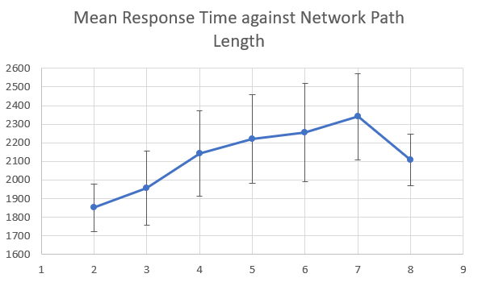

# Results

## Nelson 5018 Semantic Association Wordlist

Graphed using a pruned complete network by cosine similarity distance between nodes (`abs(a.dot(b) - 1) < 0.1`) and a minimum number of 3 edges for each node.

Even within a much larger dataset, we observe clustering effects among the semantic concepts. For this graph, we have a average local clustering coefficient of `0.19355`.

### Predicting Response Times using path length in network

Using our constructed network, we query it with the (prompt, target) pairs given to human subjects and extract the path lenghts from prompt to target. To examine how this extracted path length is related to measured response time in human subjects, an average of each subjects' response time to a given (prompt, target) pair is taken. This mean is then added to the respective list for its path length. For example: the (prompt, target) pair (REVIEW, ADJECTIVE) has the path (review evaluate understand describe adjective) in our network with a path length of 5.

*In this comparison, the minimum path length is **2** for a target that is directly connected to a prompt.*

Mean response times of (prompt, target) pairs grouped by observed network path lengths from prompt to target:

| Path Length | Mean Response Times | Standard Deviation |
| ----------- |:-------------------:| ------------------:|
| 2 | 1850.672788 | 253.341439 |
| 3 | 1955.860505 | 395.233799 |
| 4 | 2142.147454 | 455.5789075 |
| 5 | 2218.92387  | 475.9042756 |
| 6 | 2254.852955 | 529.4472688 |
| 7 | 2339.68549  | 466.4608815 |
| 8 | 2107.908918 | 279.5967494 |
