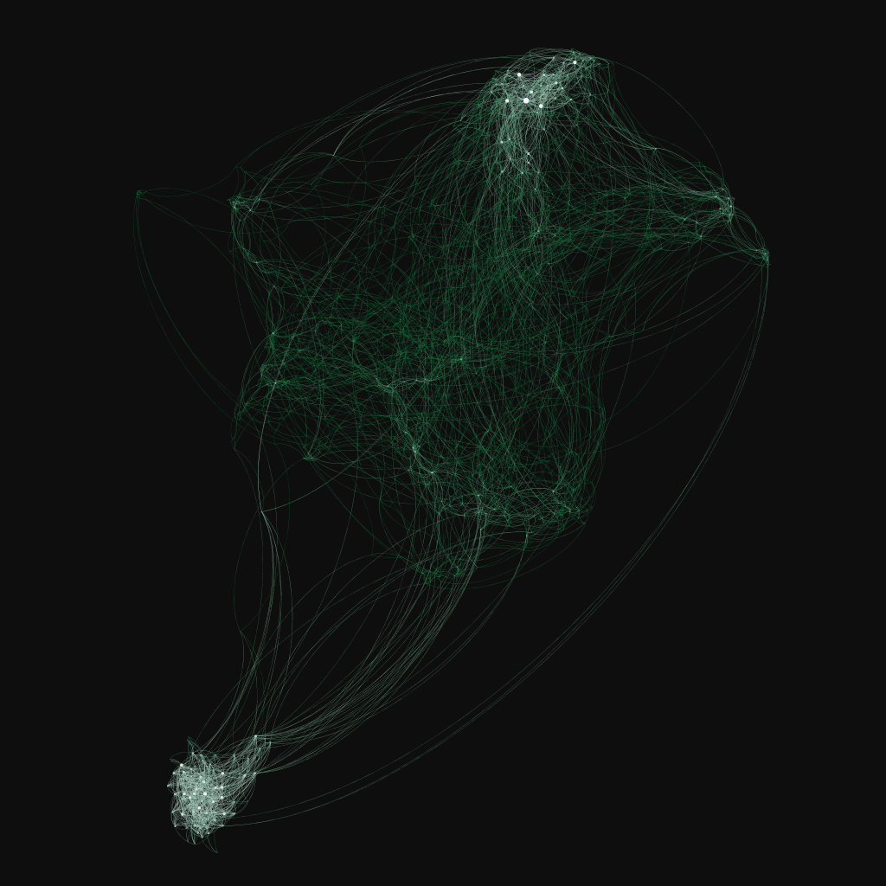

# Constructing Networks from word2vec vectors

## Setup Instructions:

1. Download googlenews pre-trained vectors, unzip it and place it within a 'data/' folder in this project
2. Make sure you have python3.7 64bit installed and have it in your PATH
3. Run `sh setup.sh` bash script from an admin console
4. Run `sh cache.sh` bash script to run python scripts to generate file dependencies
5. Run `python network.py -t gexf <graph> <limit>` to run the graph generating script and generate a .gexf graph output for visualization
6. See `python network.py -h` for the full utilization options

A `network_<graph>_<limit>.gexf` file will be generated which contains our graph information.


# Results

## Nelson 5018 Semantic Association Wordlist


Graphed using a pruned complete network by cosine similarity distance between nodes (`abs(a.dot(b) - 1) < 0.1`) and a minimum number of 3 edges for each node.

Even within a much larger dataset, we observe clustering effects among the semantic concepts. Unsurprisingly, we get a average local clustering coefficient of `0.19355`.

Mean response times of (prompt, target) pairs grouped by observed network path lengths from prompt to target:

| Path Length | Mean Response Times | Standard Deviation |
| ----------- |:-------------------:| ------------------:|
| 2 | 1850.672788 | 253.341439 |
| 3 | 1955.860505 | 395.233799 |
| 4 | 2142.147454 | 455.5789075 |
| 5 | 2218.92387  | 475.9042756 |
| 6 | 2254.852955 | 529.4472688 |
| 7 | 2339.68549  | 466.4608815 |
| 8 | 2107.908918 | 279.5967494 |

# Process Description

## Graph Visualization:

[Gephi](https://gephi.org/) is used to visualize our graph data.



The above network is plotted using the data in complete_network_tight3.gexf generated from running `python network.py -t gexf -f complete_network_tight3 complete 1000 3 15`. It contains 1000 Nodes (representing the top 1000 most frequently used english words) and 6465 Edges.

Nodes are colored in a (white-green) gradient based on their degree of connectivity. Nodes with more connections appear brighter (white). We observe two major clusters in this image. The bottom-left cluster are Nouns (Country, Companies, Months, Locations) things that tends to appear in the headline for news articles. This is no surprise here since the vectors used are learned on a news corpus. The cluster near the top right are descriptive adjectives. A Grammatical separation is hinted at here (large similarity based on part of speech may be inherent within these vectors).

Filtering low-similarity edges (cosine similarity further from 1) from our initially dense complete graph:
```python
dist = 1 - model.get_distance(source, target)
if (dist > 0.1 and edges > k):
	break
```
We limit a 0.1 deviation from 1 (exactly similar) to our edges (but ensure we have at least k edges per node).

## Network Navigation Console:

`network.py` generates an additional `_log.json` file in addition to the required visualization file output. We can load this network into our console to query about its attributes and examine connectivity between nodes in this network.

Run `python interactive_network.py` with an additional `_log.json` that names the network log file we want to load and examine. Use the `-h` argument to print usage options. An additional `-d` flag can passed to enable directed mode for interpreting edges in our graph log file.

Once inside our console, we can query a variety of information regarding the graph. Typing `-help` shows the currently implemented functions:
```
Usage Instructions:
       <prime> <target>: Type in word pairs to query network path length between them
    <prime> <target> -d: Type in a word pair with the '-d' specifier to search based on edge weight
                 <word>: Type a single word to list its edges
                  -help: print this usage message
                  -list: list all nodes (words) in graph
                  -quit: exit program
             -hub <num>: list top <num> most connected nodes in graph
             -avg <num>: run <num> random searches through the graph to compute average path length
```

> Currently, we do not have a save to file option for queried data. An option will be added later. This is just an exploratory prototype for now. (Not meant for rigorous network analysis)

## References:
1. http://www.leonidzhukov.net/hse/2015/networks/lectures/lecture4.pdf
	- Preferential attachment models
	- Random method of growing smallworld networks adopted in implementation
2. https://drive.google.com/file/d/0B7XkCwpI5KDYNlNUTTlSS21pQmM/edit?usp=sharing
	- Pre-trained Google word2vec vectors (3 million words | 300 dimensions)
3. https://github.com/first20hours/google-10000-english/blob/master/google-10000-english.txt
	- Top 10000 common english words (used to take subset of the pretrained vectors)
4. https://gist.github.com/sebleier/554280
	- List to filter out common 'stopwords' - Not much semantic meaning here
